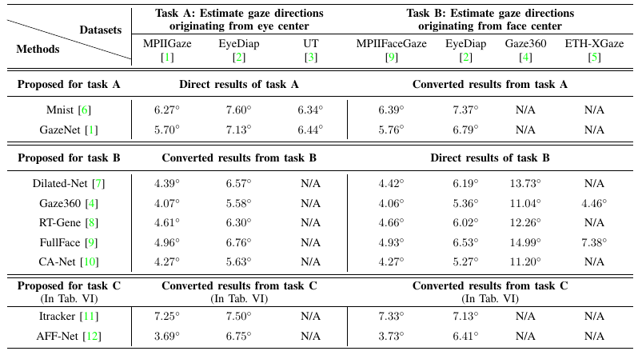
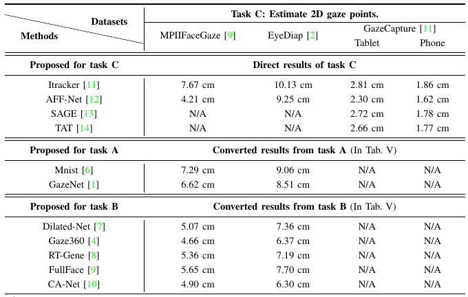

# Full-face
「It’s written all over your face: Full-face appearance-based gaze estimation」のPytorch実装（2021年4月28日更新）

私たちは、調査論文[**「Appearance-based Gaze Estimation With Deep Learning: A Review and Benchmark」**](https://arxiv.org/abs/2104.12668)で、注視推定のためのベンチマークを構築しました。これは、ベンチマーク内の「Full-face」メソッドの実装コードです。詳細については、調査論文を参照してください。

**データ処理コード**を<a href="http://phi-ai.org/GazeHub/" target="_blank">*GazeHub*</a>で使用することをお勧めします。
処理済みデータセットを使用して直接メソッドのコードを実行できます。

## 注視推定コードへのリンク

- 外観ベースの注視推定のための粗密適応ネットワーク, AAAI 2020 (近日公開)
- [Gaze360: 野外での物理的に制約のない注視推定](https://github.com/yihuacheng/Gaze360), ICCV 2019
- [膨張畳み込みを使用した外観ベースの注視推定](https://github.com/yihuacheng/Dilated-Net), ACCV 2019
- [評価ガイド付き非対称回帰による外観ベースの注視推定](https://github.com/yihuacheng/ARE-GazeEstimation), ECCV 2018
- [自然環境でのリアルタイム目の注視推定](https://github.com/yihuacheng/RT-Gene), ECCV 2018
- [MPIIGaze: 実世界データセットと深層外観ベースの注視推定](https://github.com/yihuacheng/Gaze-Net), TPAMI 2017
- [それはあなたの顔にすべて書かれています: Full-face appearance-based gaze estimation](https://github.com/yihuacheng/Full-face), CVPRW 2017
- [誰にでも使える目の追跡](https://github.com/yihuacheng/Itracker), CVPR 2016
- [野外での外観ベースの注視推定](https://github.com/yihuacheng/Mnist), CVPR 2015

## パフォーマンス
この方法は3つのタスクで評価されます。詳細については調査論文を参照してください。



## ライセンス
コードは[CC BY-NC-SA 4.0ライセンス](https://creativecommons.org/licenses/by-nc-sa/4.0/)の下で提供されています。


## イントロダクション
私たちは、leave-one-person-out評価と一般的なトレーニング-テストスプリットの評価のための2つのプロジェクトを提供します。
それらは同じアーキテクチャを持ちますが、`train.py`と`test.py`が異なります。

各プロジェクトには次のファイル/フォルダーが含まれています。
- `model.py`: モデルコード。
- `train.py`: トレーニングのエントリーポイント。
- `test.py`: テストのエントリーポイント。
- `config/`: 各データセットの実験設定が含まれます。コードを実行するには、**独自の** `config.yaml`を書いてください。
- `reader/`: データローダーコード。提供されたリーダーを使用するか、自分でリーダーを作成できます。

## はじめに
### 独自の*config.yaml*を書く

通常、トレーニング用には次の変更が必要です。
1. `train.save.save_path`: モデルは`$save_path$/checkpoint/`に保存されます。
2. `train.data.image`: 画像のパスです。提供されたデータ処理コードを使用してください。<a href="http://phi-ai.org/GazeHub/" target="_blank">*GazeHub*</a>。
3. `train.data.label`: ラベルのパスです。
4. `reader`: 使用するリーダーを示します。`reader`フォルダー内のファイル名です。例: *reader/reader_mpii.py* ==> `reader: reader_mpii`。

テスト用には次の変更が必要です。
1. `test.load.load_path`: 通常は`train.save.save_path`と同じです。テスト結果は`$load_path$/evaluation/`に保存されます。
2. `test.data.image`: 通常は`train.data.image`と同じです。
3. `test.data.label`: 通常は`train.data.label`と同じです。

### トレーニング

leaveoutフォルダーで次のように実行できます。
```
python train.py config/config_mpii.yaml 0
```
これは、`config_mpii.yaml`を使用し、`0番目`の人物をテストセットとして使用することを意味します。

また、次のように実行できます。
```
bash run.sh train.py config/config_mpii.yaml
```
これは、leave-one-person-outトレーニングを自動的に実行することを意味します。`run.sh`はイテレーションを実行します。異なるデータセットのために`run.sh`のイテレーション回数を変更できます。例: 四重検証のためにイテレーション回数を`4`に設定します。

traintestフォルダーで次のように実行できます。
```
python train.py config/config_mpii.yaml
```

### テスト
leaveoutフォルダーで次のように実行できます。
```
python test.py config/config_mpii.yaml 0
```
または
```
bash run.sh test.py config/config_mpii.yaml
```

traintestフォルダーで次のように実行できます。
```
python test.py config/config_mpii.yaml
```

### 結果
トレーニングまたはテスト後、結果は`config_mpii.yaml`の`$save_path$`から見つけることができます。


## 引用
私たちのコードを使用する場合は、以下を引用してください。
```
@inproceedings{Zhang_2017_CVPRW,
	title={It’s written all over your face: Full-face appearance-based gaze estimation},
	author={Zhang, Xucong and Sugano, Yusuke and Fritz, Mario and Bulling, Andreas},
	booktitle={The IEEE Conference on Computer Vision and Pattern Recognition Workshops (CVPRW)},
	pages={2299--2308},
	month={July},
	year={2017},
	organization={IEEE}
}

@article{Cheng2021Survey,
        title={Appearance-based Gaze Estimation With Deep Learning: A Review and Benchmark},
        author={Yihua Cheng and Haofei Wang and Yiwei Bao and Feng Lu},
        journal={arXiv preprint arXiv:2104.12668},
        year={2021}
}
```
## 連絡先
質問やコメントがある場合は、yihua_c@buaa.edu.cnまでメールしてください。


## 参考文献

1. MPIIGaze: 実世界データセットと深層外観ベースの注視推定
2. EYEDIAPデータベース: データ記述と注視追跡評価ベンチマーク
3. 合成による学習：外観ベースの3D注視推定
3. Gaze360: 野外での物理的に制約のない注視推定
5. ETH-XGaze: 極端な頭の向きと注視変動下での大規模データセット
6. 野外での外観ベースの注視推定  
7. 膨張畳み込みを使用した外観ベースの注視推定
8. 自然環境でのリアルタイム目の注視推定
9. それはあなたの顔にすべて書かれています: Full-face appearance-based gaze estimation
10. 粗密適応ネットワークによる外観ベースの注視推定
11. 誰にでも使える目の追跡
12. モバイルタブレットでの注視追跡のための適応機能融合ネットワーク
13. スマートフォンでの実用的な注視推定に向けた一般化されたロバストな方法
14. スマートフォン上でのリアルタイム注視推定のためのオンデバイス少量個人化